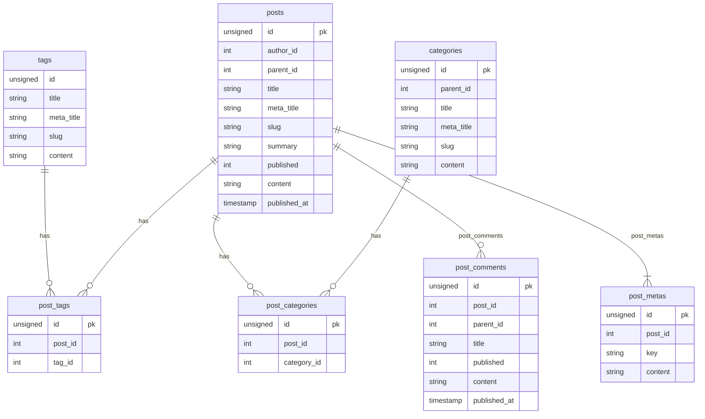

```mermaid
 erDiagram
    posts{
        unsigned id pk
        int author_id
        int parent_id
        string title
        string meta_title
        string slug
        string summary
        int published
        string content
        timestamp published_at
    }
    tags||--o{post_tags: has
    posts||--o{post_tags:has
    posts||--o{post_categories:has
    tags {
        unsigned id
        string title
        string meta_title
        string slug
        string content

    }
    categories||--o{post_categories:has
        categories{
        unsigned id pk
        int parent_id
        string title
        string meta_title
        string slug
        string  content
    }
    post_categories{
        unsigned id pk
        int post_id
        int category_id
    }
    posts||--o{post_comments:post_comments
    post_comments{
        unsigned id pk
        int post_id
        int parent_id
        string title
        int published
        string content
        timestamp published_at
    }

    posts||--|{post_metas:post_metas
    post_metas{
        unsigned id pk
        int post_id
        string key
        string content
    }
    post_tags{ 
        unsigned id pk
        int post_id
        int tag_id
    }

```
